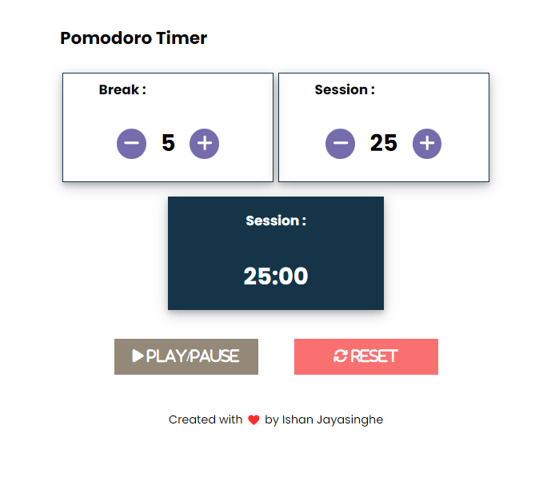

# Pomodoro Clock App

This app allows you to set session timer and rest timer according to Pomodoro Technique.

<p float="left">
  
</p>

## Features

* Set Timers: Set Session Timer and Break Timer as you wish.
* Play/Pause Timer: You can play or pause timer anytime you want ✨.
* Reset: Reset Session Timer and Break Timer anytime you want.
* Easy to Use: The app boasts a user-friendly interface, allowing you to effortlessly set timers with just a few clicks or taps.

## Experience the App
visit the [Pomodoro Clock](https://ishanj.lk/pomodoro)

## Setup App Locally

1. Clone the Repository:
    ```bash
    git clone https://github.com/ishanj-lk/Pomodoro-Clock.git
    ```
2. Open the `index.html` file in your browser to launch the app.
3. (Optional) Customize the app by modifying the `index.html`, `style.css`, and `script.js` files.

## Usage Instructions

* Open the app.
* Set timers as you want!
* Click or tap the `PLAY/PAUSE` button.
* Enjoy your work session!


## 
Visit my [portfolio](https://ishanj.lk/) for more projects and information.

